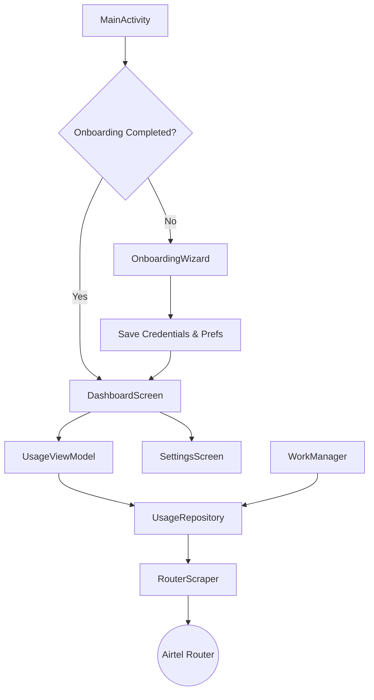

# Airtel Usage Tracker - Android App

A modern, native Android application designed to track data usage from your Airtel Xstream Fiber router. Built with **Jetpack Compose** and **WorkManager**, it runs efficiently in the background to ensure you never cross your FUP limit uniquely.

## Features

- **Smart Onboarding**: specific guided wizard to help you set up router credentials and verify connectivity immediately.
- **Real-time Dashboard**: 
    - Visualizes usage with a clean progress bar.
    - Displays total data consumed, remaining data, and percentage used.
    - Shows "Last Updated" timestamp for confidence.
- **Configurable Sync**: 
    - Choose how often to update data (e.g., every 4, 6, or 12 hours).
    - **Battery Efficient**: Updates only occur when connected to **WiFi** and battery is not low.
- **Robust Background Tracking**: 
    - Uses `WorkManager` for reliable periodic fetching.
    - **Reboot Detection**: Smart logic detects router restarts to ensure accurate cumulative billing cycle usage.
- **Manual Controls**: 
    - "Refresh Now" button with intelligent network checks.
    - Update router IP/Username/Password anytime from Settings.
    - Toggle Auto-Sync on/off.

## Tech Stack

- **Language**: Kotlin
- **UI Framework**: Jetpack Compose (Material 3)
- **Navigation**: Navigation Compose
- **Background Tasks**: WorkManager
- **Persistence**: 
    - `DataStore Preferences` (User Settings)
    - `SharedPreferences` (Router Config, Legacy)
- **Networking**: Custom HTML Scraping (Jsoup/WebView logic)

## Setup & Installation

### Prerequisites
- JDK 17+
- Android Studio Ladybug or newer
- An Android device (Android 8.0+ recommended) connected to your Airtel Router's WiFi.

### 1. Clone & Open
1. Clone the repository or copy project files to your machine.
2. Open **Android Studio**.
3. Select **Open** and navigate to the project directory (`/Users/prajw/StudioProjects/AirtelUsageTracker`).

### 2. Build & Run
1. Connect your Android device via USB or WiFi Debugging.
2. Click the **Run** ▶️ button in Android Studio.
3. The app will install and launch automatically.

### 3. First-Time Setup (Onboarding)
1. **Welcome Screen**: ensures you are connected to WiFi.
2. **Router Setup**: 
   - Default IP: `192.168.1.1`
   - Default User/Pass: `admin` / `admin`
   - **Test Connection**: Tap to verify credentials before proceeding.
3. **Sync Preferences**: Select your preferred update interval (Default: 4 hours).

## Architecture

## Important Notes

- **Battery Optimization**: For 24/7 background tracking on some devices (Samsung, Xiaomi, OnePlus), you may need to set the app battery usage to **"Unrestricted"** in system settings to prevent the OS from killing the background worker.
- **Router Compatibility**: Designed for standard Airtel Xstream Fiber routers (e.g., Nokia, ZTE, Huawei) accessible via `192.168.1.1`.

## License

MIT License. Free to use and modify!
